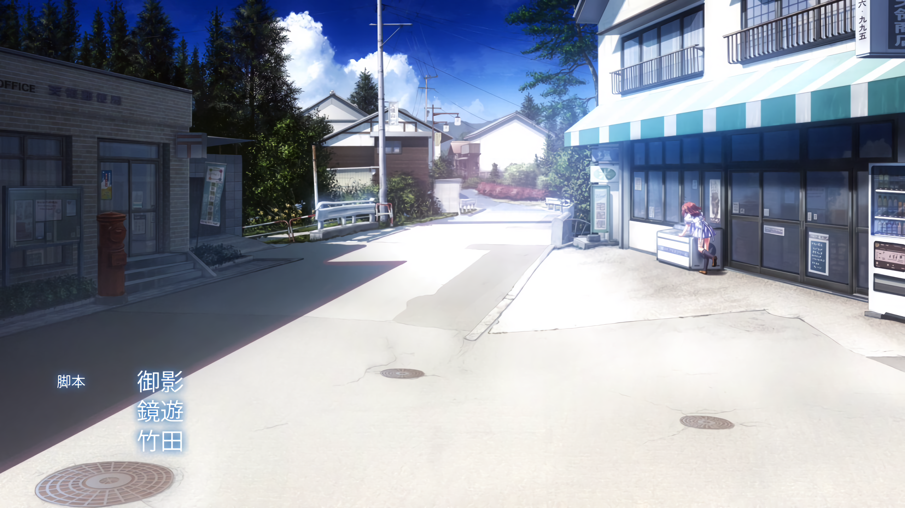

# wafiux-model
## 由waifu2x和waifu2x-chainer训练的非官方模型
#
### 训练的目的在于填补自带模型降噪带来的损失
### !!注：由于训练集的不同，并非所有场景都有更好的结果
### 以下是一部分场景模型结果比较
#
### #20221114 添加ncnn cunet模型，用于waifu2x-ncnn-vulkan，由caffe2ncnn转换，效果参考caffe
#
## 场景1
### 原图
#

### 官方Chariner UpResNet10模型
#

### 训练模型/chainer/20220101/UpResNet10

## 场景2
### 原图

### 官方Chariner UpResNet10模型

### 训练模型/chainer/20220101/UpResNet10
